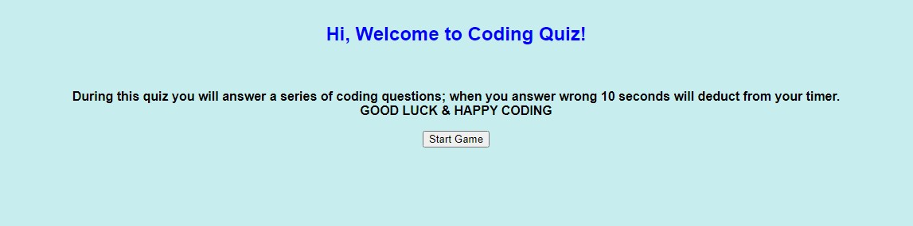

# Quiz-Me

I've created a online coding quiz that allow the user to take a quiz about coding. The user would experience the following. 
When the user cicks the start button
Then a timer starts and they are presented with a series of questions
WHEN answer a question incorrectly
THEN time is subtracted from the clock
WHEN all questions are answered or the timer reaches 0
THEN the game is over
WHEN the game is over
THEN they can save their initials and their score

# User Story
For this website, I had to use my code from scratch. This task created repetition and challenged me to think about how HTML, CSS and JS.

# Authors
Code Provided by UofM Coding Bootcamp Modifications were done by Clarence Tolson

# Acknowledgments
Thank You to the Instructors, TAs, and Classmates who have helped with codes and understanding how to approach the assignment. WS3schools.com Youtube.com Murach's HTML5 and CSS3 book. 

# Link
https://sudosapien21.github.io/Quiz-Me/

